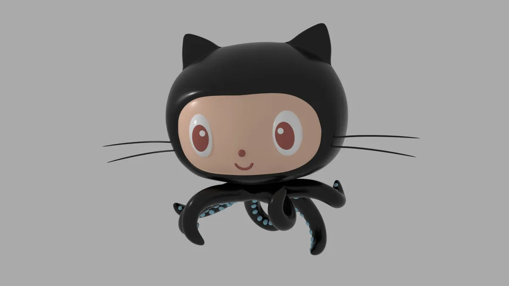

<h1 align="left">Olá , eu sou Alan Bittencourt</h1>

  

<h3>Developer from Brazil 🇧🇷:</h3>

* ### 🔥Programador de 12 anos
* ### ⌨️ Gosto muito de programar e estou aprendo mais a cada dia
* ### 🧠 Sei que ainda tenho muito a aprender

---
# 

 
 ## 🛠 &nbsp;Tech Stack
&nbsp;
&nbsp;
&nbsp;
&nbsp;
&nbsp;
&nbsp;
&nbsp;
&nbsp;
